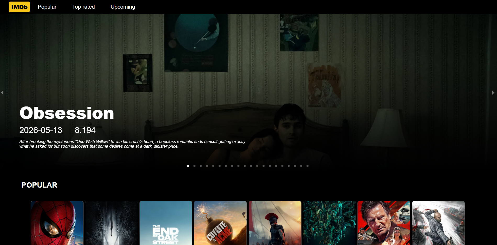

# IMDb Clone

A sleek movie landing page inspired by IMDb, built with React and a dark, cinematic design.



## Features
- Hero banner with featured movie details
- Popular, Top Rated, and Upcoming movie sections
- Responsive card-based layout
- Modern dark UI with a premium streaming look

## Run locally

```bash
npm install
npm start
```

Then open http://localhost:3000 in your browser.

## Tech stack
- React
- CSS
- React Router
- Create React App
